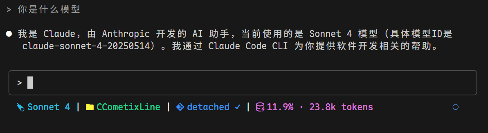

# PackyCC

A high-performance Claude Code statusline tool written in Rust with Git integration, real-time usage tracking, and API quota monitoring.

> Fork of [CCometixLine](https://github.com/Haleclipse/CCometixLine) with added PackyCode API integration and real-time quota monitoring.


## Screenshots



The statusline shows: Model | Directory | Git Branch Status | Context Window | Daily Spent | Network Latency | Opus Status

## Features

- **High performance** with Rust native speed
- **Git integration** with branch, status, and tracking info  
- **Model display** with simplified Claude model names
- **Usage tracking** based on transcript analysis
- **API quota monitoring** showing daily spending from PackyCode API
- **Directory display** showing current workspace
- **Clean design** with customizable icons
- **Simple configuration** via command line options

## Installation

Download from [Releases](https://github.com/petiky/packycc/releases):

### Linux

```bash
mkdir -p ~/.claude/ccline
wget "<your-linux-artifact-url>" -O statusline-linux-x64.tar.gz
tar -xzf statusline-linux-x64.tar.gz
cp statusline ~/.claude/ccline/statusline
chmod +x ~/.claude/ccline/statusline
```

### macOS (Intel)

```bash  
mkdir -p ~/.claude/ccline
wget "<your-macos-x64-artifact-url>" -O statusline-macos-x64.tar.gz
tar -xzf statusline-macos-x64.tar.gz
cp statusline ~/.claude/ccline/statusline
chmod +x ~/.claude/ccline/statusline
```

### macOS (Apple Silicon)

```bash
mkdir -p ~/.claude/ccline  
wget "<your-macos-arm64-artifact-url>" -O statusline-macos-arm64.tar.gz
tar -xzf statusline-macos-arm64.tar.gz
cp statusline ~/.claude/ccline/statusline
chmod +x ~/.claude/ccline/statusline
```

### Windows

```powershell
# Create directory and download
New-Item -ItemType Directory -Force -Path "$env:USERPROFILE\.claude\ccline" | Out-Null
Invoke-WebRequest -Uri "<your-windows-x64-artifact-url>" -OutFile "statusline-windows-x64.zip"
Expand-Archive -Path "statusline-windows-x64.zip" -DestinationPath "."
Move-Item "statusline.exe" "$env:USERPROFILE\.claude\ccline\" -Force
```

### Claude Code Configuration

Add to your Claude Code `settings.json`:

**Linux/macOS:**
```json
{
  "statusLine": {
    "type": "command", 
    "command": "~/.claude/ccline/statusline",
    "padding": 0
  }
}
```

**Windows:**
```json
{
  "statusLine": {
    "type": "command", 
    "command": "%USERPROFILE%\\.claude\\ccline\\statusline.exe",
    "padding": 0
  }
}
```

### Build from Source

```bash
git clone https://github.com/petiky/packycc.git
cd packycc
cargo build --release

# Linux/macOS
mkdir -p ~/.claude/ccline
cp target/release/statusline ~/.claude/ccline/statusline
chmod +x ~/.claude/ccline/statusline

# Windows (PowerShell)
New-Item -ItemType Directory -Force -Path "$env:USERPROFILE\.claude\ccline" | Out-Null
Copy-Item target\release\statusline.exe "$env:USERPROFILE\.claude\ccline\statusline.exe" -Force
```

## Usage

```bash
# Basic usage (displays all enabled segments)
statusline

# Show help
statusline --help

# Print default configuration  
statusline --print-config

# TUI configuration mode (planned)
statusline --configure
```

## Default Segments

Displays: `Model | Directory | Git Branch Status | Context Window | Today: $X.XX | Network Latency | Opus Status`

### Git Status Indicators

- Branch name with Nerd Font icon
- Status: `✓` Clean, `●` Dirty, `⚠` Conflicts  
- Remote tracking: `↑n` Ahead, `↓n` Behind

### Model Display

Shows simplified Claude model names:
- `claude-3-5-sonnet` → `Sonnet 3.5`
- `claude-4-sonnet` → `Sonnet 4`
- `claude-4-1-opus` → `Opus 4.1`

### Context Window Display

Token usage percentage based on transcript analysis with context limit tracking.

### API Quota Display

Shows daily API spending from PackyCode API when configured in `~/.config/claude/settings.json`.

### Opus Status Display

Shows whether Opus model access is enabled for your account:
- `✅ Opus` - Opus access is enabled
- `❌ No Opus` - Opus access is disabled
- `❓ Opus: N/A` - Status unknown (API error or not configured)

## Configuration

For PackyCode API integration, add to `~/.config/claude/settings.json`:

```json
{
  "env": {
    "ANTHROPIC_BASE_URL": "https://api.packycode.com",
    "ANTHROPIC_AUTH_TOKEN": "your-api-key"
  },
  "info_url": "https://www.packycode.com/api/backend/users/info"
}
```

### API Response Format

The PackyCode API (`https://www.packycode.com/api/backend/users/info`) now returns the following fields:

- `balance_usd`: Current account balance
- `total_spent_usd`: Total amount spent
- `daily_budget_usd`: Daily spending budget
- `daily_spent_usd`: Amount spent today
- `monthly_budget_usd`: Monthly spending budget
- `monthly_spent_usd`: Amount spent this month
- `opus_enabled`: Whether Opus model access is enabled (boolean)

## Performance

- **Startup time**: < 50ms (vs ~200ms for TypeScript equivalents)
- **Memory usage**: < 10MB (vs ~25MB for Node.js tools)
- **Binary size**: ~2MB optimized release build

## Requirements  

- Git (optional, for git integration)  
- Terminal with Nerd Font support
- Claude Code for statusline integration

## Development

```bash
# Build development version
cargo build

# Run tests
cargo test

# Build optimized release
cargo build --release
```

## Roadmap

- [ ] TOML configuration file support
- [ ] TUI configuration interface
- [ ] Custom themes
- [ ] Plugin system
- [ ] Cross-platform binaries

## Contributing

Contributions are welcome! Please feel free to submit issues or pull requests.

## Credits

- Original project: [CCometixLine](https://github.com/Haleclipse/CCometixLine) by Haleclipse
- PackyCode API integration and enhancements by [petiky](https://github.com/petiky)

## License

This project is licensed under the [MIT License](LICENSE).

## Star History

[](https://star-history.com/#petiky/packycc&Date)
