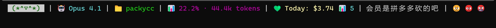

# PackyCC

A high-performance Claude Code statusline tool written in Rust with Git integration, real-time usage tracking, API quota monitoring, and customizable segments.

> Fork of [CCometixLine](https://github.com/Haleclipse/CCometixLine) with added PackyCode API integration, real-time quota monitoring, and extensive customization options.


## Screenshots



The statusline shows: Model | Directory | Git Status | Context Window | Daily Spent | Emoji | Ranking | Time | Network | Spinner

## Features

### Core Features
- **High performance** with Rust native speed (<50ms startup time)
- **Git integration** with branch, status, and tracking info  
- **Model display** with simplified Claude model names
- **Usage tracking** based on transcript analysis
- **API quota monitoring** showing daily spending from PackyCode API
- **Directory display** with smart path truncation
- **Opus status display** showing model access availability

### New Segments (Customizable)
- **🎨 Emoji Segment** - Display custom emojis with configurable cycle intervals
- **🏆 Ranking Segment** - Show user rank/level based on usage or custom metrics
- **⏰ Time Segment** - Display current time in various formats (12/24 hour, with/without seconds)
- **🌐 Network Segment** - Monitor network connectivity status
- **⚡ Spinner Segment** - Animated loading indicators for ongoing operations

### Customization
- **TOML Configuration** - Full configuration via `config.toml` file
- **Segment Toggle** - Enable/disable any segment
- **Custom Colors** - Configure colors for each segment
- **Icon Customization** - Use custom icons or disable them
- **Layout Control** - Choose segment order and separators

## Installation

### Quick Install (Windows)

Run the provided install script:
```powershell
.\install.bat
```

### Manual Installation

Download from [Releases](https://github.com/zhangjintao950326/packycc/releases):

#### Linux
```bash
mkdir -p ~/.claude/ccline
wget "<your-linux-artifact-url>" -O statusline-linux-x64.tar.gz
tar -xzf statusline-linux-x64.tar.gz
cp statusline ~/.claude/ccline/statusline
chmod +x ~/.claude/ccline/statusline
```

#### macOS (Intel)
```bash  
mkdir -p ~/.claude/ccline
wget "<your-macos-x64-artifact-url>" -O statusline-macos-x64.tar.gz
tar -xzf statusline-macos-x64.tar.gz
cp statusline ~/.claude/ccline/statusline
chmod +x ~/.claude/ccline/statusline
```

#### macOS (Apple Silicon)
```bash
mkdir -p ~/.claude/ccline  
wget "<your-macos-arm64-artifact-url>" -O statusline-macos-arm64.tar.gz
tar -xzf statusline-macos-arm64.tar.gz
cp statusline ~/.claude/ccline/statusline
chmod +x ~/.claude/ccline/statusline
```

#### Windows
```powershell
# Create directory and download
New-Item -ItemType Directory -Force -Path "$env:USERPROFILE\.claude\ccline" | Out-Null
Invoke-WebRequest -Uri "<your-windows-x64-artifact-url>" -OutFile "statusline-windows-x64.zip"
Expand-Archive -Path "statusline-windows-x64.zip" -DestinationPath "."
Move-Item "statusline.exe" "$env:USERPROFILE\.claude\ccline\" -Force
```

### Claude Code Configuration

Add to your Claude Code `settings.json`:

**Linux/macOS:**
```json
{
  "statusLine": {
    "type": "command", 
    "command": "~/.claude/ccline/statusline",
    "padding": 0
  }
}
```

**Windows:**
```json
{
  "statusLine": {
    "type": "command", 
    "command": "%USERPROFILE%\\.claude\\ccline\\statusline.exe",
    "padding": 0
  }
}
```

### Build from Source

```bash
git clone https://github.com/zhangjintao950326/packycc.git
cd packycc
cargo build --release

# Linux/macOS
mkdir -p ~/.claude/ccline
cp target/release/statusline ~/.claude/ccline/statusline
chmod +x ~/.claude/ccline/statusline

# Windows (PowerShell)
New-Item -ItemType Directory -Force -Path "$env:USERPROFILE\.claude\ccline" | Out-Null
Copy-Item target\release\statusline.exe "$env:USERPROFILE\.claude\ccline\statusline.exe" -Force
```

## Configuration

### Basic Configuration

Create `config.toml` in `~/.claude/ccline/`:

```toml
# Main configuration
theme = "dark"
first_run = false

# JWT Token configuration (required for ranking feature)
# To get your JWT token:
# 1. Go to PackyCode website (https://www.packycode.com)
# 2. Open browser DevTools (F12) -> Network tab
# 3. Look for API requests and find your JWT token in the Authorization header
# 4. Copy the token (without "Bearer " prefix) and paste it here
jwt_token = "your_jwt_token_here"

# Segment enable/disable
[segments]
model = true
directory = true
git = true
usage = true
quota = true
emoji = true
ranking = true
time = true
network = true
spinner = false

# Emoji segment configuration
[emoji]
enabled = true
emojis = ["🚀", "✨", "🎯", "🔥", "⚡", "💫", "🌟", "💎"]
cycle_seconds = 60  # Change emoji every 60 seconds

# Ranking segment configuration
[ranking]
enabled = true
levels = [
    { threshold = 0, label = "Novice", icon = "🌱" },
    { threshold = 100, label = "Apprentice", icon = "⚔️" },
    { threshold = 500, label = "Expert", icon = "🏆" },
    { threshold = 1000, label = "Master", icon = "👑" },
    { threshold = 5000, label = "Legend", icon = "🔮" }
]

# Time segment configuration
[time]
enabled = true
format_24h = true
show_seconds = false
use_icon = true

# Network segment configuration
[network]
enabled = true
check_interval = 30  # Check every 30 seconds
timeout = 5000       # 5 second timeout

# Directory segment configuration
[directory]
max_length = 30
use_icon = true

# Git segment configuration
[git]
show_remote = true
use_icons = true
```

### PackyCode API Configuration

For PackyCode API integration, add to `~/.config/claude/settings.json`:

```json
{
  "env": {
    "ANTHROPIC_BASE_URL": "https://api.packycode.com",
    "ANTHROPIC_AUTH_TOKEN": "your-api-key"
  },
  "info_url": "https://www.packycode.com/api/backend/users/info"
}
```

## Usage

```bash
# Basic usage (displays all enabled segments)
statusline

# Show help
statusline --help

# Print current configuration  
statusline --print-config

# Use custom config file
statusline --config /path/to/config.toml

# Enable/disable segments via command line
statusline --no-emoji --no-ranking

# Force specific display mode
statusline --mode compact
```

## Segment Details

### Model Display
Shows simplified Claude model names:
- `claude-3-5-sonnet` → `Sonnet 3.5`
- `claude-4-sonnet` → `Sonnet 4`
- `claude-4-1-opus` → `Opus 4.1`

### Git Status Indicators
- Branch name with Nerd Font icon
- Status: `✓` Clean, `●` Dirty, `⚠` Conflicts  
- Remote tracking: `↑n` Ahead, `↓n` Behind

### Context Window Display
Token usage percentage based on transcript analysis with smart context limit detection.

### Ranking System
Customizable user levels based on:
- Daily/monthly usage
- Total spending  
- Custom metrics via API

**Note:** The ranking feature requires a JWT token from PackyCode. See the Configuration section for setup instructions.

### Time Display
Flexible time formatting:
- 12/24 hour format
- Optional seconds display
- Custom time zones (planned)

### Network Status
Real-time network monitoring:
- `🟢` Connected
- `🔴` Disconnected  
- `🟡` Limited connectivity

### Emoji Rotation
Configurable emoji display:
- Custom emoji lists
- Adjustable rotation intervals
- Category-based selections

## Performance

- **Startup time**: < 50ms (vs ~200ms for TypeScript equivalents)
- **Memory usage**: < 10MB (vs ~25MB for Node.js tools)
- **Binary size**: ~2MB optimized release build
- **Update frequency**: Real-time with minimal CPU usage

## Requirements  

- Git (optional, for git integration)  
- Terminal with Nerd Font support (recommended)
- Claude Code for statusline integration

## Development

```bash
# Build development version
cargo build

# Run tests
cargo test

# Build optimized release
cargo build --release

# Run with debug output
RUST_LOG=debug cargo run

# Benchmark performance
cargo bench
```

## Roadmap

- [x] TOML configuration file support
- [x] Custom emoji segment
- [x] Ranking/level system
- [x] Time display segment
- [x] Network status monitoring
- [ ] TUI configuration interface
- [ ] Custom themes and color schemes
- [ ] Plugin system for custom segments
- [ ] WebSocket support for real-time updates
- [ ] Multi-language support

## Contributing

Contributions are welcome! Please feel free to submit issues or pull requests.

### Development Guidelines
1. Follow Rust best practices
2. Add tests for new features
3. Update documentation
4. Run `cargo fmt` and `cargo clippy` before submitting

## Credits

- Original project: [CCometixLine](https://github.com/Haleclipse/CCometixLine) by Haleclipse
- PackyCode API integration and enhancements by [petiky](https://github.com/petiky)
- Extended features and customization by [zhangjintao950326](https://github.com/zhangjintao950326)

## License

This project is licensed under the [MIT License](LICENSE).

## Star History

[](https://star-history.com/#zhangjintao950326/packycc&Date)